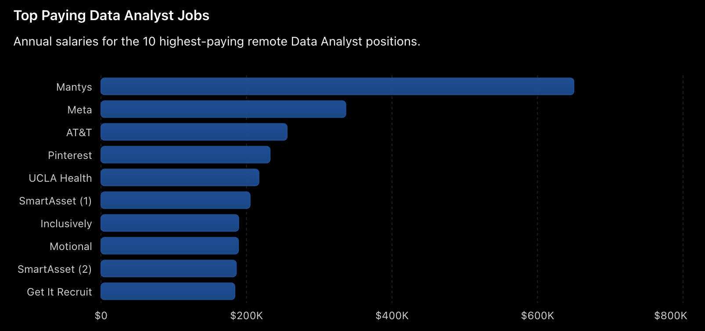
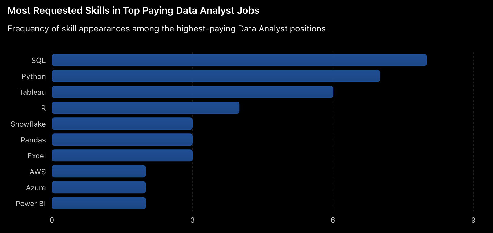
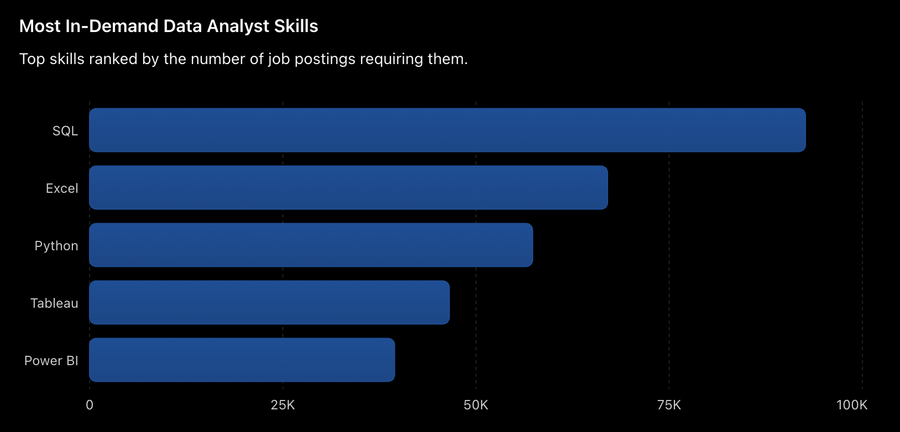
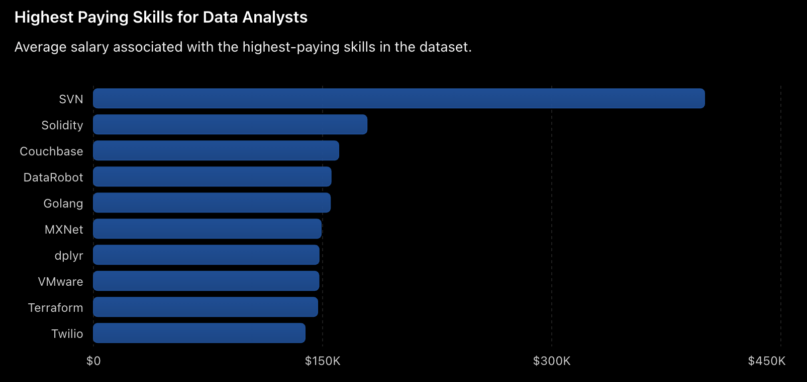
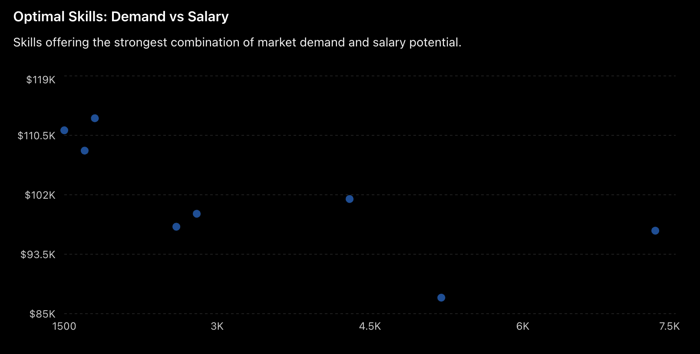

# Introduction
This project explores the Data Analyst job market using SQL-based data analysis techniques. By querying a real-world job postings dataset, the project identifies:

The highest-paying Data Analyst roles
Skills required for top-paying jobs
Most in-demand skills in the market
Highest-paying technical skills
Optimal skills that balance both demand and salary

The goal is to provide actionable insights for aspiring and professional Data Analysts who want to align their learning path with current industry requirements.

The SQL queries?...check them here: [SQL Project](/project/)
# Background
The demand for Data Analysts continues to grow across industries, but not all skills offer the same career opportunities or salary potential.

This project was created to answer several important questions:

1. Which Data Analyst jobs offer the highest salaries?
2. What skills are required for those positions?
3. Which skills appear most frequently in job postings?
4. Which skills command the highest salaries?
5. Which skills provide the best combination of high demand and high compensation?

The analysis uses SQL to transform raw job market data into meaningful career insights.
# Tools I Used

### 🛢️ SQL

SQL was the primary tool used to query, filter, aggregate, and analyze job market data. It enabled the extraction of meaningful insights related to salary trends, skill demand, and career opportunities for Data Analysts.

**Key concepts applied:**
- JOINs
- Common Table Expressions (CTEs)
- Aggregate Functions
- GROUP BY & ORDER BY
- Filtering & Ranking
- Subqueries


### 🐘 PostgreSQL

PostgreSQL was used as the relational database management system for storing and querying the dataset. Its robust SQL support made it ideal for performing large-scale analytical operations.

**Why PostgreSQL?**
- Efficient data processing
- Advanced SQL capabilities
- Industry-standard database platform
- Reliable performance for analytical workloads


### 💻 Visual Studio Code (VS Code)

VS Code served as the primary development environment for writing, testing, and organizing SQL scripts throughout the project.

**Features utilized:**
- SQL syntax highlighting
- Query development and debugging
- Integrated terminal
- Project organization


### 🌱 Git

Git was used for version control, allowing changes to be tracked throughout the development process and ensuring a structured workflow.

**Key uses:**
- Version tracking
- Change management
- Experimentation through commits
- Maintaining project history


### 🚀 GitHub

GitHub was used to host the project repository and showcase the analysis as part of a professional data analytics portfolio.

**Key uses:**
- Repository hosting
- Project documentation
- Portfolio presentation
- Collaboration and sharing
- Integration with Git version control

# The analysis
### 1. Top Paying Data Analysis Jobs
### Objective
Identify the highest-paying remote Data Analyst roles.

```sql
SELECT
    job_title,
    salary_year_avg,
    name AS company_name
FROM job_postings_fact
LEFT JOIN company_dim
    ON job_postings_fact.company_id = company_dim.company_id
WHERE
    job_title_short = 'Data Analyst'
    AND job_location = 'Anywhere'
    AND salary_year_avg IS NOT NULL
ORDER BY salary_year_avg DESC
LIMIT 10;
```

### Key Findings
- Top salaries range from $184K–$650K.
- Leadership roles command the highest compensation.
- Tech companies offer the strongest salary packages.
- Remote opportunities remain highly lucrative.

### Visualization


### 2. Skills Required for Top Paying Data Analyst Jobs

### Objective
Identify the skills most frequently requested by the highest-paying Data Analyst positions.

```sql
WITH top_paying_jobs AS (
    SELECT
        job_id,
        salary_year_avg
    FROM job_postings_fact
    WHERE
        job_title_short = 'Data Analyst'
        AND job_location = 'Anywhere'
        AND salary_year_avg IS NOT NULL
    ORDER BY salary_year_avg DESC
    LIMIT 10
)

SELECT
    skills_dim.skills
FROM top_paying_jobs
INNER JOIN skills_job_dim
    ON top_paying_jobs.job_id = skills_job_dim.job_id
INNER JOIN skills_dim
    ON skills_job_dim.skill_id = skills_dim.skill_id;
```

### Key Findings
- SQL is the most frequently requested skill among top-paying roles.
- Python and Tableau are commonly required alongside SQL.
- High-paying positions value a mix of analytics, programming, and visualization skills.
- Cloud technologies such as AWS, Azure, and Snowflake appear in several premium roles.

### Visualization


### 3. Most In-Demand Skills

### Objective
Identify the skills most frequently requested in Data Analyst job postings.

```sql
SELECT
    skills,
    COUNT(skills_job_dim.job_id) AS demand_count
FROM job_postings_fact
INNER JOIN skills_job_dim
    ON job_postings_fact.job_id = skills_job_dim.job_id
INNER JOIN skills_dim
    ON skills_job_dim.skill_id = skills_dim.skill_id
WHERE job_title_short = 'Data Analyst'
GROUP BY skills
ORDER BY demand_count DESC
LIMIT 5;
```

### Key Findings
- SQL is the most in-demand skill, appearing in over 92,000 job postings.
- Excel remains a highly sought-after tool despite the rise of modern analytics platforms.
- Python ranks among the top technical skills, reflecting the growing importance of automation and advanced analytics.
- Tableau and Power BI continue to be the leading data visualization tools in the job market.

### Visualization



### 4. Highest Paying Skills

### Objective
Identify the skills associated with the highest average salaries in Data Analyst roles.

```sql
SELECT
    skills,
    ROUND(AVG(salary_year_avg),2) AS avg_salary
FROM job_postings_fact
INNER JOIN skills_job_dim
    ON job_postings_fact.job_id = skills_job_dim.job_id
INNER JOIN skills_dim
    ON skills_job_dim.skill_id = skills_dim.skill_id
WHERE
    job_title_short = 'Data Analyst'
    AND salary_year_avg IS NOT NULL
GROUP BY skills
ORDER BY avg_salary DESC
LIMIT 25;
```

### Key Findings
- Specialized technologies command significantly higher salaries than common analyst tools.
- Skills such as Solidity, Couchbase, Golang, and Terraform are among the highest-paying technologies.
- Many top-paying skills are related to software engineering, cloud infrastructure, and emerging technologies.
- Niche expertise often leads to higher compensation due to lower talent availability.

### Visualization



### 5. Optimal Skills Analysis

### Objective
Identify the skills that provide the strongest combination of high demand and high salary for Data Analysts.

```sql
WITH skills_demand AS (
    SELECT
        skills,
        COUNT(skills_job_dim.job_id) AS demand_count
    FROM job_postings_fact
    INNER JOIN skills_job_dim
        ON job_postings_fact.job_id = skills_job_dim.job_id
    WHERE
        job_title_short = 'Data Analyst'
        AND job_work_from_home = TRUE
    GROUP BY skills
)

SELECT
    skills,
    demand_count,
    avg_salary
FROM skills_demand
INNER JOIN average_salary
    ON skills_demand.skill_id = average_salary.skill_id
WHERE demand_count > 10
ORDER BY avg_salary DESC;
```

### Key Findings
- SQL offers the best balance between market demand and earning potential.
- Python combines strong demand with above-average salaries, making it a highly valuable skill.
- Tableau and Power BI remain important for analysts seeking broad employment opportunities.
- Specialized tools such as Snowflake and Azure provide strong salary potential while maintaining solid market demand.

### Visualization



# What I learned
Throughout this project, several important insights emerged:

Business Insights
1. High-paying Data Analyst positions often require specialized technical expertise.
2. Salary growth is strongly correlated with advanced analytical tools.
3. Remote opportunities continue to offer competitive compensation.

Technical Insights
1. SQL remains one of the most important skills for Data Analysts.
2. Complex analytical questions can be solved efficiently using joins and CTEs.
3. Data aggregation techniques provide powerful decision-making insights.

Career Insights

The most valuable skills are not always the most demanded skills.

The strongest career strategy is to focus on skills that provide:

1. High demand
2. High salary potential
3. Long-term industry relevance

# Conclusions

This project analyzed Data Analyst job postings to identify the highest-paying roles, the most in-demand skills, and the technologies that offer the strongest combination of demand and salary.

The analysis revealed that SQL is the most valuable core skill for Data Analysts, consistently appearing across high-paying positions and in-demand job postings. Additionally, skills such as Python, Tableau, Power BI, and cloud technologies provide strong opportunities for career growth and increased earning potential.

By combining salary and demand metrics, this project highlights a practical roadmap for professionals looking to make data-driven decisions about skill development and career progression.

Overall, the project demonstrates how SQL can be used to transform raw data into actionable insights that support strategic decision-making.
